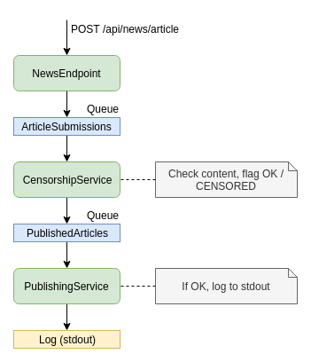
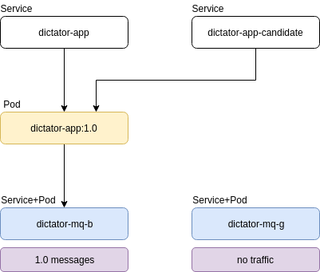
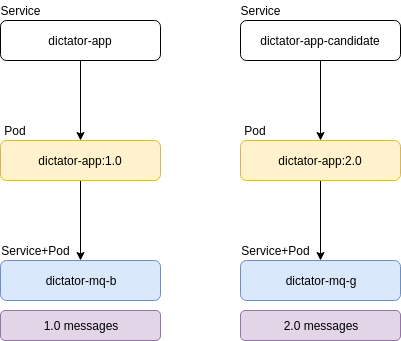
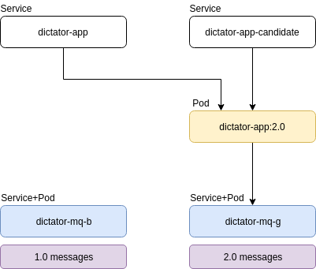
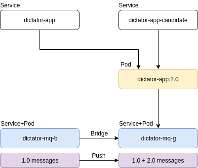
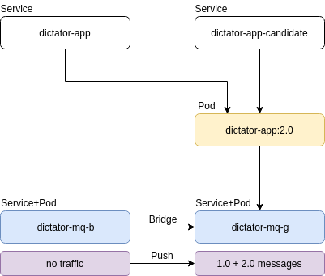
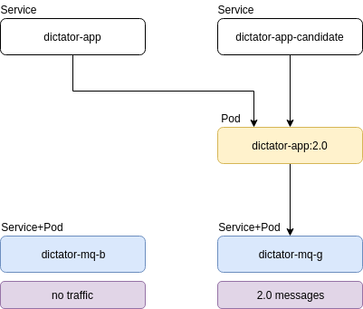

# Dictator App

## Intro

Dictator App is a demo application for demonstrating Blue/Green deployment of an application that uses ActiveMQ. 
It helps autocratic regimes to censor news articles.

The app consists of three components

- **NewsEndpoint** - REST Endpoint (`POST /api/news/article`) that receives new articles in format `{"title":"Something", "content":"Some content"}`
  and posts it to the `ArticleSubmissions` queue for further processing by `CensorshipService`.
- **CensorshipService** - Processes the `ArticleSubmissions` queue, looks at the content of the articles and decides whether it will mark the
  article as `OK` or `CENSORED` before it sends them further.
  - If article is `OK` it goes to to `PublishedArticles` queue.
  - If article is `CENSORED` it goes to to `CensoredArticles` topic.
- **PublishingService** - Processes the `PublishedArticles` queue and logs the article content to `STDOUT`
- **PressMonitoringService** - Processes the `CensoredArticles` topic and logs the article title and censorship date to `STDOUT`



## Building

### Building the app

Run `bin/build-docker-app.sh` to create a docker image `dictator-app:<version>`.

### Building the ActiveMQ server

Run `bin/build-docker-mq.sh` to create a docker image `dictator-activemq:<version>`

## Running locally

### Running ActiveMQ server

```
export ARTEMIS_DATA_DIR=/tmp/artemis1
bin/run-docker-mq.sh 61616 8161 5445 5672 1883 61613 172.17.0.3 61617
export ARTEMIS_DATA_DIR=/tmp/artemis2
bin/run-docker-mq.sh 61617 8162 5446 5673 1884 61618 172.17.0.2 61616
```

- NOTE: Change `ARTEMIS_DATA_DIR` value for something that makes sense for your system.
- NOTE: assign target IPs based on your docker env

### Running the app

```
bin/run-docker-app.sh 8080 172.17.0.2 61616
bin/run-docker-app.sh 8081 172.17.0.3 61617
```

- NOTE: assign target IPs based on your docker env

## API Access

GET the official propaganda article

```
curl -H "Content-type: application/json" http://localhost:8080/api/news/article
```

POST an article

```
curl -d '{"title":"hello", "content":"a message"}' -H "Content-type: application/json" http://localhost:8080/api/news/article
```

## Command-line tools

- `bin/logs.sh` - Show logs of
  - **a**pp
  - **c**andidate app
  - **b**lue MQ
  - **g**reen MQ
- `bin/check-queues.sh` - Show message counts in queues and topics
- `bin/check-bridges.sh` - Show bridges and their states
- `bin/create-bridge.sh` - Create bridges for all of the queues/topics in 
  - **b**lue MQ
  - **g**reen MQ
- `bin/destroy-bridge.sh` - Create bridges for all of the queues/topics in 
  - **b**lue MQ
  - **g**reen MQ
- `bin/kube-apply.sh` - Initial deployment of Kubernetes objects to Google Cloud
- `bin/kube-deploy-candidate.sh` - Deploy currently checked out app version (make sure you've built it)
- `bin/kube-promote-candidate.sh` - Switch `dictator-app` service to new version and delete deployment of old version 
- `bin/kube-info.sh`- Print which MQ server is configured with current deployment
- `bin/kube-port-forward.sh` - Port-forward to localhost
  - **b**lue MQ
  - **g**reen MQ
- `bin/mq-admin.sh` - Run Java MQ Admin (the tool must be built with `bin/build-admin.sh`)
- `bin/build-admin.sh` - Builds the Java MQ Admin tool (basically not needed)
- `bin/pause.sh` - Pause/resume processing of these addressess: *submitted*,*published* and *censored*
  - USAGE:
    - `bin/pause.sh {b|g} {submitted|published|censored} {p|r}` - **p**ause/**r**esume given address, in **b**lue or **g**reen MQ
    - `bin/pause.sh {b|g}` - Show paused status in given MQ
- `bin/build-docker-app.sh` - Maven build the app, create docker image and push it into the GCR repository, uses current git tag
- `bin/build-docker-mq.sh` - Create Artemis ActiveMQ docker image and push it into the GCR repository, uses current git tag
- `bin/run-docker-app.sh` - Runs current tag of app in local docker
- `bin/run-docker-mq.sh` - Runs current tag of MQ server in local docker
- `bin/post.sh` - Posts new article to the app via it's REST API
  - USAGE:
    - `bin/post.sh "Article TITLE" "Article CONTENT"`
    - NOTE: if article content contains string `dictator is corrupt` then it will be censored
    - NOTE: if article content equals `candidate` then it's posted to `dictator-app-candidate` endpoint instead of `dictator-app`
    - NOTE: if article content equals `loop` then it will be reposted every second until the script is killed


## Google Cluster Kubernetes setup

1. Create a test cluster, either [manually](https://console.cloud.google.com/kubernetes/list?authuser=1&project=aqueous-charger-221113&template=standard-cluster) or using `gcloud` CLI, e.g:

```
gcloud container clusters create learning-cluster \
    --num-nodes 4 \
    --machine-type g1-small \
    --zone europe-west1-c

gcloud container clusters get-credentials learning-cluster
```

2. Copy `build.conf.example` to `build.conf` and fill in your values.

3. Create Kubernetes objects

```
bin/kube-apply.sh
```

4. Manual: Change load-balancer IP to static and set your DNS so that the address e.g. `example.com` in `APP_DOMAIN` (in build.conf) points to it

5. If your address is `example.com`, you should be able to access these services:
- [dictator-app.example.com](http://dictator-app.example.com)
- [dictator-mq-b.example.com](http://dictator-mq-b.example.com)
- [dictator-mq-g.example.com](http://dictator-mq-g.example.com)

6. You can check status of your services using
```
bin/kube-info.sh
```

- NOTE: to run some of the scripts, you need to install [jq](https://stedolan.github.io/jq/) and [curl](https://curl.haxx.se/).

## Blue/Green Deployment

### 1 Initial state

After deployment of the first version `1.0` you'll have the following scenario



### 2 Candidate deployment

Deploy candidate (version `2.0`). This can be done using the script
```
bin/kube-deploy-candidate.sh
```
You'll end up with something like this



This creates a separate service `dictator-app-candidate` which you can run End-to-end tests against. This will be a new pod configured with completely separate MQ server `dictator-mq-g`

### 3 Candidate promotion

After you checked that the version `2.0` behaves correctly (with it's independent MQ `dictator-mq-g`), you can remove the old version and direct all of the production traffic to the new pod. 
After this you'll also gracefully shutdown version `1.0` pod. This may leave some unprocessed messages in it's MQ server `dictator-mq-b`.



You can promote candidate using

```
bin/kube-promote-candidate.sh
```

### 4 Handling unprocessed old messages

The unprocessed messages can now be fed via bridge to the new active MQ server `dictator-mq-g`. There's **N-1 compatibility** between versions `1.0` and `2.0` messages, i.e. version `2.0` app 
can process version `1.0` messages.



After all of the messages are transferred via the ActiveMQ [Core bridge](https://activemq.apache.org/artemis/docs/1.0.0/core-bridges.html), the bridge can be shut down.

To create and destroy bridges, you can use these commands
```
bin/create-bridge.sh b
bin/destroy-bridge.sh b
```
- NOTE: These will create and destroy bridge `dictator-mq-b` -> `dictator-mq-g`. Use letter `g` instead of `b` to create and destroy the opposite direction bridge.
  These work with ActiveMQ Artemis Jolokia REST API.



### 5 Wait until old messages are processed

Before we can switch roles of `dictator-mq-b` and `dictator-mq-g` and deploy another version, we need to wait until all of the `1.0` messages are processed, so that we don't need to maintain
compatibility between another version and this one. You can check the status with `bin/check-queues.sh` command.



## Command-line tools

- `bin/logs.sh` - Show logs of
  - **a**pp
  - **c**andidate app
  - **b**lue MQ
  - **g**reen MQ
- `bin/check-queues` - Show message counts in queues and topics
- `

## Use cases

### Update application

```
git tag <new_version>

# This will create new pod and point dictator-app-candidate service to it:
bin/kube-deploy-candidate.sh

# Run e2e tests: this posts to the candidate URL:
bin/post.sh test candidate

# <<OPTIONAL>> Pause production traffic to get some messages that will need to migrate and be processed by new version
bin/pause.sh <active-mq> published p
bin/pause.sh <active-mq> censored p
bin/post.sh test1 "safe content"
bin/post.sh test2 "safe content"
bin/post.sh test3 "safe content"
bin/post.sh test1 "dictator is corrupt"
bin/post.sh test2 "dictator is corrupt"
bin/post.sh test3 "dictator is corrupt"
# <<OPTIONAL>>

# After you're done with test, promote the candidate, this will delete the old version
bin/kube-promote-candidate.sh

# <<OPTIONAL>> Now resume the traffic in the now inactive mq
bin/pause.sh <inactive-mq> published r
bin/pause.sh <inactive-mq> censored r
# <<OPTIONAL>>

# To find out which MQ is used by active app:
bin/kube-info.sh

# Create bridge on the mq that is now NOT active, so that it pushes messages to the active one
bin/create-bridge.sh <inactive-mq>

# To check the message transfer progress
bin/check-queues.sh

# Then destroy the bridge
bin/destroy-bridge.sh <inactive-mq>

# Now check how your active app deals with the old messages and when they're consumed, you ready to repeat the cycle
bin/check-queues.sh
```

### Update MQ server

When you need to update the MQ server, you usually want to do something like

- update the ActiveMQ Artemis version
- change ActiveMQ configuration
- add a topic or a queue
- remove a topic or a queue

You start in a state where you have a running app using the **ACTIVE** (blue or green) MQ server.
To ensure an uninterrupted traffic, you simply update the **INACTIVE** MQ server.

```
# To find out which MQ is used by active app:
bin/kube-info.sh

# Now just replace the inactive MQ server with newer version
bin/update-mq.sh
```
In your next B/G deployment cycle you'll start using this server, so make sure your new App version is compatible with the configuration. 

#### Removing a queue/topic

Your **N+1** version needs to process/discard messages that were sent to it by the old version. 

The old bridging scripts will still create bridge for the old queues
After migration you can also remove the queue from scripts that create bridges.

#### Adding a queue/topic

The old version will not produce any data to this new queue, so no special action needed here.
Add the queue to the list of bridges in create-bridge scripts.

#### Renaming a queue/topic

This can be handled by bridges, configure them to forward to a newly named address


