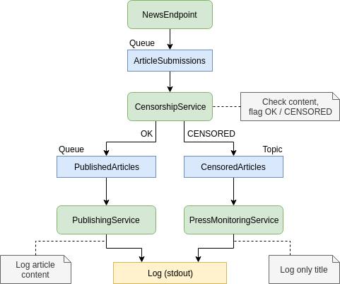

# Dictator App

## Intro

Dictator App is a demo application for demonstrating Blue/Green deployment of an application that uses ActiveMQ. 
It helps autocratic regimes to censor news articles.

The app consists of three components

- **NewsEndpoint** - REST Endpoint (`POST /api/news/article`) that receives new articles in format `{"title":"Something", "content":"Some content"}`
  and posts it to the `ArticleSubmissions` queue for further processing by `CensorshipService`.
- **CensorshipService** - Processes the `ArticleSubmissions` queue, looks at the content of the articles and decides whether it will mark the
  article as `OK` or `CENSORED` before it sends them to `PublishedArticles` queue.
- **PublishingService** - Processes the `PublishedArticles` queue. It will log the article content to `STDOUT` only if it has been marked as `OK` by the censors.



## Building

### Building the app

Run `build.sh` to create a docker image `dictator-app:<version>`.

### Building the ActiveMQ server

Run `build-activemq.sh` to create a docker image `dictator-activemq:<version>`

## Running

### Running ActiveMQ server

```
docker run -it --rm \
  -p 8161:8161 \
  -p 61616:61616 \
  -e ARTEMIS_USERNAME=dictator \
  -e ARTEMIS_PASSWORD=ourleader \
  -v ${ARTEMIS_DATA_DIR}:/var/lib/artemis/data:rw,z \
  dictator-activemq:`git describe --tags`
```

### Running the app

```
docker run -it -p 8080:8080 --network host \
    -e ACTIVEMQ_HOST=localhost \
    -e ACTIVEMQ_PORT=61616 \
    -e ACTIVEMQ_USER=dictator \
    -e ACTIVEMQ_PASSWORD=ourleader \
    -e CENSORSHIP_DURATION=3000 \
    dictator-app:`git describe --tags`
```

## API Access

GET the official propaganda article

```
curl -H "Content-type: application/json" http://localhost:8080/api/news/article
```

POST an article

```
curl -d '{"title":"hello", "content":"a message"}' -H "Content-type: application/json" http://localhost:8080/api/news/article
```

